# 设计文档

[TOC]

## 引言

### 目的

​		运用JavaEE企业级系统开发、数据库系统、面向对象技术及UML以及软件需求工程所学专业知识，解决所设定业务领域软件开发中的需求分析、软件设计、系统部署等问题，培养解决工程问题的能力

### 内容

​		设计并实现一个职工工资管理系统

### 需求

#### 1.账户管理

(1) 内置系统管理员账户和人力资源工作人员账户；

(2) 创建/禁用/删除/查询其他账户；

(3) 个人基本信息：账户名、个人真实姓名、性别、年龄、联系方式等；

(4) 关联账户至指定部门；

#### **2.** **部门管理**   

(1) 内置人力资源部、财务部；

(2) 创建/更名/合并/删除部门；

#### 3.授权

(1) 给账户授予权限；

(2) 不同的权限可以使用的功能不同；

(3) 权限可以使用内置、固定的方式实现；

#### 4.薪资基本参数

(1) 每个员工的基本薪资都不相同，并可以由人力资源管理人员设置；

(2) 迟到，旷工扣薪标准可以设置；

(3) 加班薪资可分为周末加班（2倍）和节日加班（3倍），加班时长按照小时计算；

#### 5．奖惩录入

(1) 市场部人员有销售提成；

(2) 节日发放员工福利奖金；

(3) 年末发放年终奖金；

(4) 录入迟到、旷工、加班等奖惩记录；

#### 6．薪资发放

(1) 只在有经过审核后，才能发放薪资。

#### **7**．薪资查看

(1) 个人账户中可以查看自己的薪资情况；

(2) 部门经理可以查看本部门所有人的薪资情况；

(3) 财务部门和人力资源部门可以查看全公司所有人的薪资情况；

#### 8．薪资统计

(1) 按需对公司的薪资发放情况进行统计，以便人力资源和财务部门对公司的人力成本进行评估和评价；

## 功能划分

### 组织结构

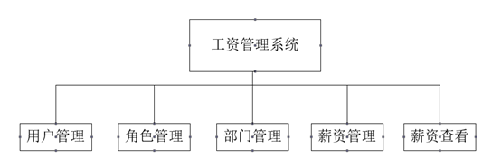

### 用例图

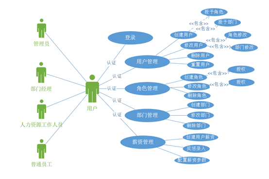

### 数据库设计	

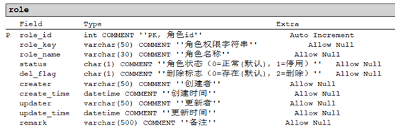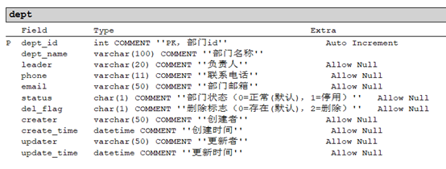

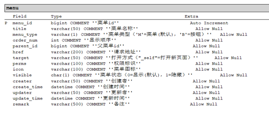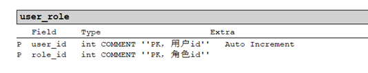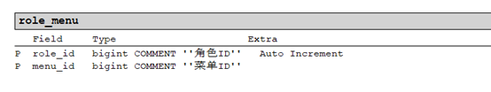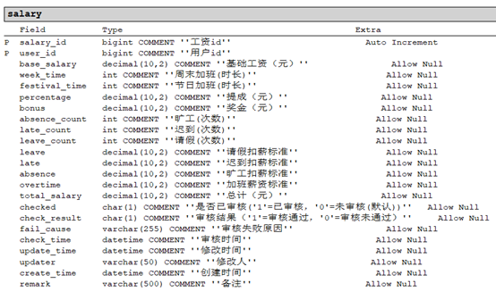

## 系统结构设计

### 文件命名

1、动名词

2、长度为2-3个单词

3、驼峰式

4、体现文件内容和含义

### 文件结构

  前端

```java
templates------ thymeleaf模板页面
static-------静态文件
```

后端

```java
src
 main
	java
		com.salary
			config--------------配置包
			controller----------控制器
			dao-----------------mapper映射接口
			entity--------------实体
			exception-----------全局异常处理
			interceptor---------拦截器
			model---------------控制模型
			schedule------------定时器
			service-------------服务层
				imp-------------实现包
			util----------------工具包
			web-----------------thymeleaf网络服务
			SalaryApplication.java----启动类
	resoures
		mapper-------------------mapper映射器
		application.yml----------主配置文件
		application-dev.yml------数据库配置文件
pom.xml--------------------------依赖文件

```

截图


### 基于RBAC用户角色权限结构

RBAC（Role-Based Access Control，基于角色的访问控制），就是用户通过角色与权限进行关联。简单地说，一个用户拥有若干角色，每一个角色拥有若干权限。本系统在此基础上进行简化，将权限放置在菜单字段中。并利用shiro安全认证框架是实现了按钮级别的权限控制。

在一些敏感的管理系统会进行认证，只有该登录用户所在的角色拥有该模块的访问权限，系统才会允许访问。如图

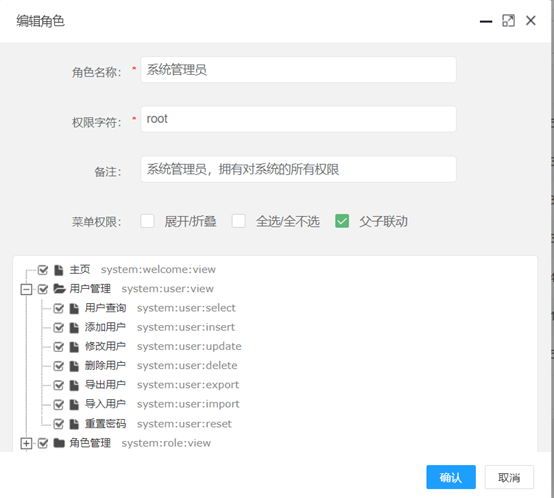

## 软件界面截图

### 登录

地址：http://localhost:8080/salary/

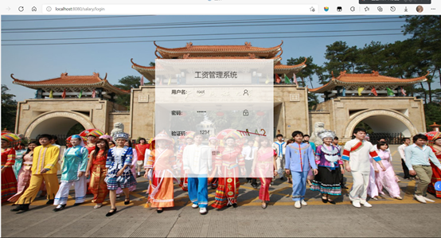

### 管理员界面

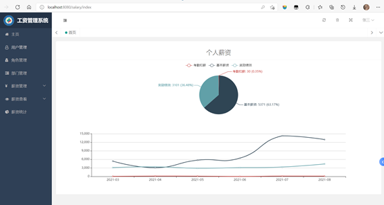

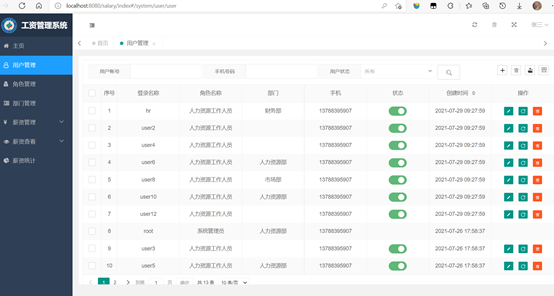

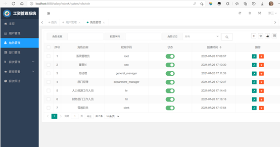

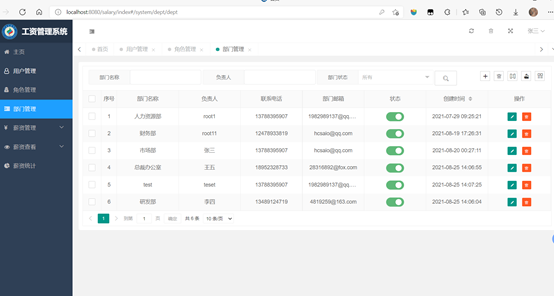

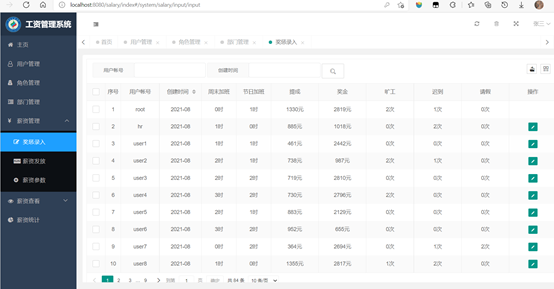

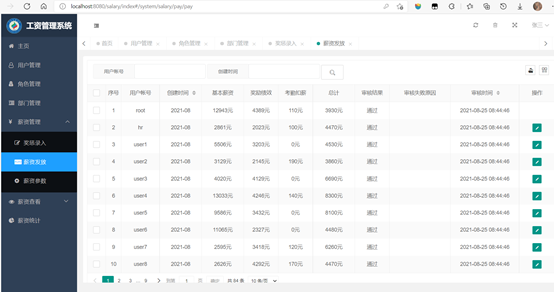


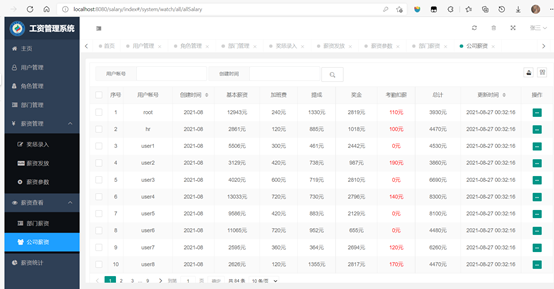


## 系统开发配置

### 技术栈

1. 核心框架：Spring Boot。

2. 安全框架：Apache Shiro。

3. 模板引擎：Thymeleaf。

4. 持久层框架：MyBatis。

5. 数据库连接池：Druid。

6. 工具类：Fastjson。

### 硬件设备

数据库：mysql、redis

